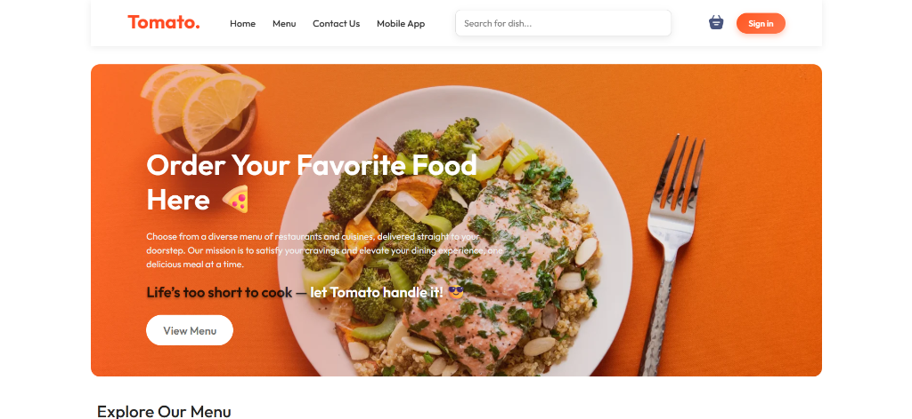
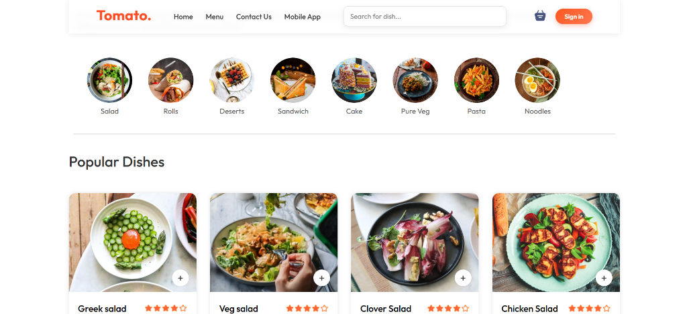

# Tomato - Food Delivery Application

## 📌 Problem Statement
Food delivery services are essential in the modern world, yet many systems face issues regarding speed, real-time data caching, secure transactions, and menu management.
- **Why this project was needed:** Users need a lightweight, responsive, and blazing-fast interface to order food from local menus without overhead.
- **Challenges users face:** Slow page reloads, insecure checkout processes, complex authentication steps, and delayed status updates on orders.
- **Existing limitations:** Monolithic platforms often suffer from slow queries when loading extensive food menus, and restaurant admins struggle with rigid menu management tools.

---

## 💡 Solution
Tomato simplifies online food ordering through a fast, modern single-page application built on a robust MERN architecture enhanced by Redis caching.
- **Overall workflow:**
  1. Users sign up/login securely via custom JWT or Google OAuth.
  2. Browse food items filtered by category (Salad, Rolls, Deserts, Sandwich, Cake, Pure Veg, Pasta, Noodles).
  3. Manage items dynamically in a persistent shopping cart.
  4. Complete secure payments via Stripe integration.
  5. Check order status history, while admins manage menu listings and order fulfillment from a dedicated admin dashboard.
- **Key features:** Caching for high-frequency data, instant cart synchronization, secure Stripe checkout, dynamic menu filtering, and an advanced admin portal.
- **Architecture overview:** Decoupled React frontend and React-based Admin panel communicating with an Express/Node.js API gateway, utilizing MongoDB for persistent storage, Redis for fast caching/caching states, Cloudinary for menu image hosting, and Stripe for payments.
- **Benefits:** Seamless and reliable user experience, optimized response times via Redis, secure credential hashing, and zero-fuss media uploads.

---

## 🛠 Tech Stack

### Frontend
- React.js (v19)
- Tailwind CSS
- Vite
- React Router DOM
- React Scroll
- React Toastify / Hot Toast

### Backend
- Node.js
- Express.js
- Redis Client
- Multer & Cloudinary
- Mongoose (MongoDB ODM)
- Stripe SDK

### Database & Caching
- MongoDB
- Redis

### Authentication
- JSON Web Token (JWT) & bcryptjs
- Google OAuth (`@react-oauth/google` & `google-auth-library`)

### Deployment
- Render (Backend)
- Vercel (Frontend & Admin Panel)

---

## ✨ Features

- **User Authentication:** Dual login options using custom Email/Password authentication or Google One-Tap Sign-In.
- **Interactive Cart Management:** Real-time quantity adjustments, price calculations, and persistent cart states.
- **Stripe Payments Integration:** Fully integrated secure payment gateway processing for mock/live transactions.
- **Redis Caching:** Integrated Redis layer caching database query operations to maximize application throughput and performance.
- **Admin Dashboard:** Admin panel to add new food items with Cloudinary image storage integration, track orders, and update delivery statuses.
- **Responsive UI:** Clean, modern, responsive interface optimized for desktop, tablet, and mobile screens.

---

## 📷 Sample Images

### Home Page (Hero Banner)



---

### Explore Menu & Popular Dishes



---

## 🚀 Installation

### 1. Clone the Repository
```bash
git clone <repo-url>
cd Tomato
```

### 2. Backend Setup
1. Navigate to the backend directory:
   ```bash
   cd backend
   ```
2. Install dependencies:
   ```bash
   npm install
   ```
3. Create a `.env` file in the `backend/` directory:
   ```env
   PORT=5000
   MONGOURL=your_mongodb_connection_uri
   JWT_SECRET=your_jwt_secret
   STRIPE_SECRET_KEY=your_stripe_secret_key
   CLOUDINARY_CLOUD_NAME=your_cloudinary_name
   CLOUDINARY_API_KEY=your_cloudinary_key
   CLOUDINARY_API_SECRET=your_cloudinary_secret
   ALLOWED_ORIGINS=http://localhost:5173,http://localhost:5174
   ```
4. Start the development server:
   ```bash
   npm start
   ```

### 3. Frontend Setup
1. Navigate to the frontend directory:
   ```bash
   cd ../frontend
   ```
2. Install dependencies:
   ```bash
   npm install
   ```
3. Create a `.env` file in the `frontend/` directory:
   ```env
   VITE_BACKEND_URL=http://localhost:5000
   VITE_GOOGLE_CLIENT_ID=your_google_client_id
   ```
4. Start the frontend:
   ```bash
   npm run dev
   ```

### 4. Admin Panel Setup
1. Navigate to the admin directory:
   ```bash
   cd ../admin/vite-project
   ```
2. Install dependencies:
   ```bash
   npm install
   ```
3. Create a `.env` file in the `admin/vite-project/` directory:
   ```env
   VITE_BACKEND_URL=http://localhost:5000
   ```
4. Start the admin panel:
   ```bash
   npm run dev
   ```
